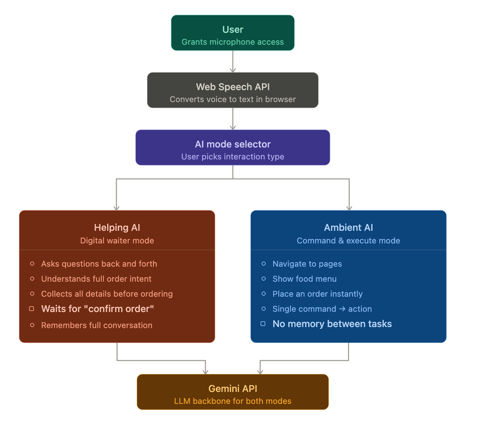

# OrdereAI: Voice-First Commerce Engine
**Live Application:** [ordereai.netlify.app](https://ordereai.netlify.app)

> **Architectural Vision:** A zero-latency, voice-integrated commerce platform built on React 19, designed to bridge the gap between non-deterministic natural language and deterministic DOM state.

## AI Voice Guide: How to Interact
To ensure 100% intent accuracy, follow this workflow:

* **Select Your Mode:** Use **Ambient** for quick, direct actions (e.g., "Scroll down") or **Helping** for a guided, conversational experience.
* **The Activation:** Click the microphone icon once to start listening.
* **Speak Naturally:** Speak your order or navigation request clearly.
* **Confirmation (Helping Mode Only):** The AI will summarize your order. Say **"Yes"** or **"Confirm"** to finalize the transaction.
---
## System Workflow

---
## 🛠️ Key Technical Achievements

### 1. Continuous Ambient Awareness (No Wake-Words)
* **The Problem:** Traditional "Push-to-Talk" or "Hey AI" wake-words create friction and feel clunky in a fast-paced environment.
* **The Solution:** Implemented a persistent microphone stream that remains active throughout the session. The system uses a **Flush-Buffer Mechanism** to distinguish between background noise and actionable intents without requiring a manual trigger.

### 2. React 19 + Selector-less UI Mapping
* **Decoupled Intelligence:** Unlike traditional automation that relies on brittle CSS selectors or IDs, this project uses **Intent-to-Action Mapping**. 
* **Architecture:** The AI interprets the *purpose* of the user’s request and maps it directly to React 19 state transitions. This makes the UI "selector-less" and remarkably resilient to layout changes.

### 3. Spatial DOM Navigation
* **Semantic Movement:** Achieved smooth, spatial navigation (scrolling, section jumping) through intent parsing. The AI understands spatial context (e.g., "Show me more" or "Go back up") and executes precise DOM manipulations in real-time.

### 4. Human Self-Correction & Contextual Memory
* **Seamless Rollbacks:** In "Helping Mode," the architecture handles human conversational patterns like self-correction (e.g., *"Add a burger... wait, no, make that a spicy chicken wrap instead"*). 
* **Logic:** By maintaining a short-term conversational buffer, the AI identifies "negation" and "replacement" intents, ensuring the final cart state reflects the user's ultimate goal.

---

## Performance & Reality-Checks

### The Latency Challenge: 100ms vs. Reality
* **Native Speed:** Browser-level speech updates are near-instant (<100ms). However, reaching a full LLM-intent-to-action cycle in under 100ms is a physical impossibility due to round-trip times (RTT) and inference latency.
* **The Flash Strategy:** I chose **Gemini 1.5 Flash** specifically for its best-in-class speed-to-intelligence ratio. While faster APIs like Groq exist (hitting ~300ms), I prioritized a stable **1s execution target**. This ensures the AI has enough "thinking time" to remain accurate while still feeling responsive to the human ear.

### The "Zero False-Positive" Goal
* **Why 0% is the Target:** In a commerce setting, a false-positive (ordering the wrong thing) costs money.
* **The Solution:** While absolute 0% is theoretically impossible for any probabilistic model, my "Helping Mode" utilizes a **Double-Confirmation Guardrail**. The AI is programmed to ask for confirmation before high-stakes actions, effectively reducing the false-positive rate to near-zero in practice.

---

## Scalability: The "Tomorrow" Roadmap

### Spatial Mapping & Ambient Noise Filtering
To handle large-scale deployments in high-noise environments (like a busy kitchen or street):

1.  **Server-Side VAD (Voice Activity Detection):** Transitioning from browser-native detection to a dedicated VAD layer (like Silero) to filter out background chatter and clinking dishes before it ever hits the LLM.
2.  **Contextual Spatial Graph:** For complex UIs, I would implement a **UI Metadata Tree**. Instead of the AI "guessing" where a button is, the system provides the AI with a live map of visible coordinates, allowing for pixel-perfect spatial control.

---

## Challenges Overcome
* **State Hydration:** Achieved sub-100ms UI hydration for local state updates while the LLM processes the broader intent.
* **Hardware Sync:** Managed the hardware lifecycle of `SpeechRecognition` to prevent permission crashes during page transitions—a common pitfall in single-page applications.
---
## Troubleshooting & Error Management
Building on a free-tier API presents unique challenges. I have implemented proactive error handling to manage the following:

* **Error 429 (Too Many Requests):** Occurs if the AI is pinged too rapidly. 
    * *Action:* Wait 5–10 seconds and try again.
* **Error 503 (Service Unavailable):** Occurs when the global Gemini servers are at peak capacity.
    * *Action:* Refresh the page or wait 30 seconds for the server buffer to clear.
* **Microphone Reset:** If the mic stops registering, simply click the mic icon to toggle it off and back on to reset the hardware bridge.

## A Note on the Prototype Experience
> **Apology for the Inconvenience:** As this is an MVP utilizing a free-tier API to demonstrate architectural feasibility, you may encounter occasional rate-limit pauses. I have intentionally built robust "Fail-Safe" notifications (Toasts) to ensure the user is always informed of the system's status. In a production environment, this UI would be powered by a dedicated high-throughput instance for a seamless, zero-latency experience.
